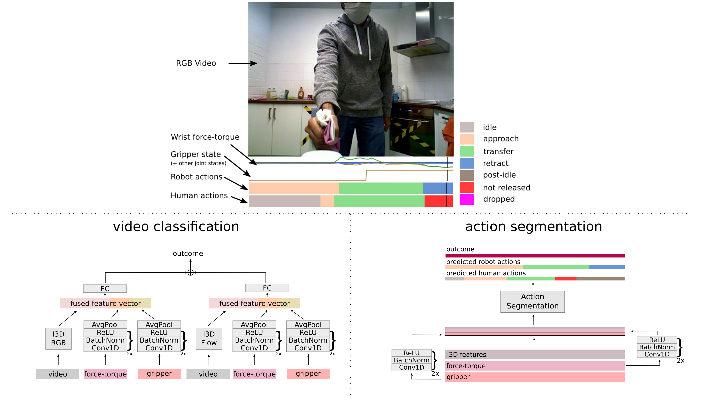

This repository contains the code for the paper "A Multimodal Handover Failure Detection Dataset and Baselines" to appear at the [2024 IEEE International Conference on Robotics and Automation](https://2024.ieee-icra.org/). A link to the paper and dataset can be found [here](https://sthoduka.github.io/handover_failure_detection/).



## Dependencies
See [requirements.txt](requirements.txt)


## Methods
The code for both the video classification and human action segmentation methods are included.

1. Video Classification

We use the implementation of the I3D model from [here](https://github.com/piergiaj/pytorch-i3d). See [pytorch-i3d-trainer/README.md](pytorch-i3d-trainer/) for instructions on how to train and evaluate the different variants mentioned in the paper.


2. Human Action Segmentation

We use the implementation of the MS-TCN model from [here](https://github.com/yabufarha/ms-tcn). See [ms-tcn/README.md](ms-tcn/) for instructions on how to train and evaluate the different variants mentioned in the paper.

## Citation
Please cite the paper as follows:
```
@inproceedings{thoduka2024_icra,
    author = {Thoduka, Santosh and Hochgeschwender, Nico and Gall, Juergen and Pl\"{o}ger, Paul G.},
    title = {{A Multimodal Handover Failure Detection Dataset and Baselines}},
    booktitle={2024 IEEE International Conference on Robotics and Automation (ICRA)},
    year = {2024},
    pages={17013-17019},
    doi={10.1109/ICRA57147.2024.10610143}
}
```
