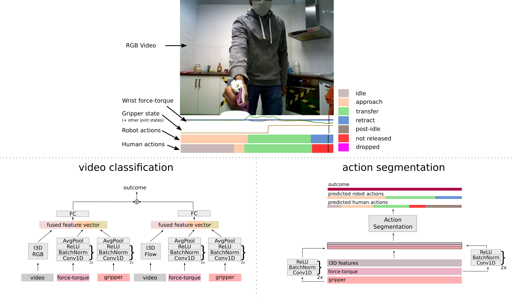

## A Multimodal Handover Failure Detection Dataset and Baselines
Santosh Thoduka, Nico Hochgeschwender, Juergen Gall and Paul G. Plöger

**Abstract**: An object handover between a robot and a human is a coordinated action which is prone to failure for reasons such as miscommunication, incorrect actions and unexpected object properties. Existing works on handover failure detection and prevention focus on preventing failures due to object slip or external disturbances. However, there is a lack of datasets and evaluation methods that consider unpreventable failures caused by the human participant. To address this deficit, we present the multimodal Handover Failure Detection dataset, which consists of failures induced by the human participant, such as ignoring the robot or not releasing the object. We also present two baseline methods for handover failure detection: (i) a video classification method using 3D CNNs and (ii) a temporal action segmentation approach which jointly classifies the human action, robot action and overall outcome of the action. The results show that video is an important modality, but using force-torque data and gripper position help improve failure detection and action segmentation accuracy.

<iframe width="640" height="360" src="https://www.youtube.com/embed/ZYQCa6hiYdM?si=mGo2F9eLWs5ocAWJ" title="YouTube video player" frameborder="0" allow="accelerometer; autoplay; clipboard-write; encrypted-media; gyroscope; picture-in-picture; web-share" referrerpolicy="strict-origin-when-cross-origin" allowfullscreen></iframe>

#### Citation

Please cite the paper as follows:

    @inproceedings{thoduka2024_icra,
        author = {Thoduka, Santosh and Hochgeschwender, Nico and Gall, Juergen and Pl\"{o}ger, Paul G.},
        title = {{A Multimodal Handover Failure Detection Dataset and Baselines}},
        booktitle = {Proceedings of the IEEE International Conference on Robotics and Automation (ICRA)},
        year = {2024}
    }

